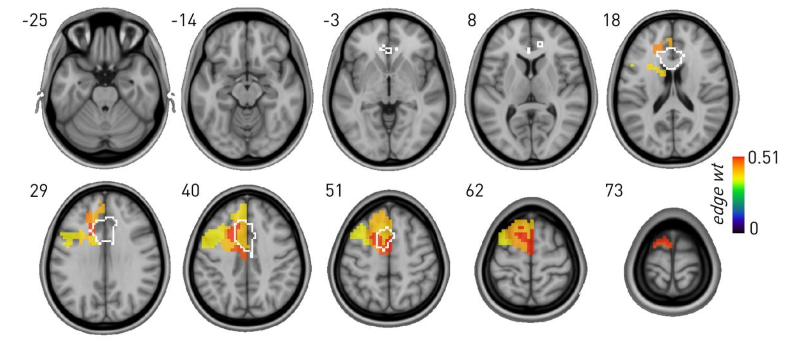
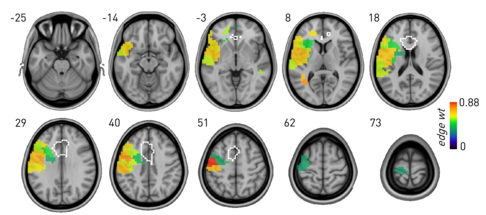

# Analysis code for the article [Cognitive control & the anterior cingulate cortex: necessity & coherence](URL)

1) [Graph lesion deficit mapping of fluency](gLDM_fluency.ipynb)

*Graph lesion-deficit mapping of phonemic fluency showing the behaviour-associated mean edge weights for stochastic block model (SBM)-defined regions significantly associated with the behaviour compared with lesion co-occurrence. Note inferred dependence on left prefrontal regions, including within the anterior cingulate cortex (ACC) ROI (outlined in white).*

2) [Graph lesion deficit mapping of stroop](gLDM_stroop.ipynb)

*Graph lesion-deficit mapping of Stroop showing the behaviour-associated mean edge weights for SBM-defined regions significantly associated with the behaviour compared with lesion co-occurrence. Note inferred left frontotemporal dependence, excluding the ACC ROI (outlined in white).*

3) [Post-hoc model comparison](post_hoc_comparison.ipynb) with [Bayesian regression](stroop_bayesreg.m)